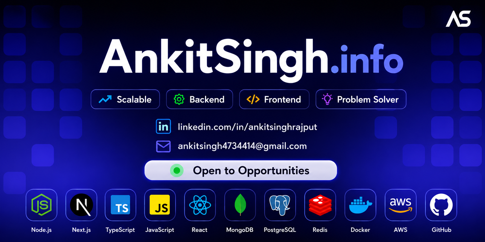

<!--  -->

<!-- <h1 align="center"></h1> -->

  
 
<!-- 

  
    Hi, I'm Ankit Singh,
  
  
    
  
  
    a Full Stack Developer based in India.
  

 -->

<!--   -->

<!--  -->
<!--  -->
<!--  -->
<!--  -->
<!--  -->
<!--  -->
<!--  -->
<!--  -->

<!--  -->
<!--  -->

<!--  -->
<!-- &#8287;&#8287; -->
<!-- 

 -->

<h3>Engineering products that <i>scale</i> & <i>stick</i> with time.</h3>

- 💼 **Full-Stack Engineer** (2+ Years Exp) at **IMS Pvt. Ltd.** — Architecting **[CreditKlick](https://creditklick.com)**, a leading Fintech Marketplace. Designed highly scalable microservices, implemented async processing pipelines, and reduced Web Core Vitals (TTI/LCP) by up to 40%.

- ⚡ **Backend & Distributed Systems:** Expert in building highly concurrent architectures. Implemented **Message Queues (RabbitMQ)** for 10K+ payloads/min fan-out engines, **Advanced Redis Caching (Cache-Aside)** for low-latency DB queries, and **Real-Time WebSockets** for live dashboards.

- ⚛️ **Frontend & Performance Engineering:** Architected high-performance React.js & Next.js SPAs. Specialized in **Advanced State Management (RTK/Zustand)**, comprehensive technical SEO via **JSON-LD Schema**, and SSR optimizations.

- 🚀 **Featured Projects:**
  - **[CreditKlick](https://creditklick.com) — Leading Fintech Marketplace**
    - **Architecture:** Engineered an async video generation pipeline processing **500+ heavy jobs/hour** and a multi-channel **Fan-Out Notification Engine** distributing **10K+ payloads/min**.
    - **Performance:** Optimized critical paths reducing **Time to Interactive (TTI) by 40%** and **Largest Contentful Paint (LCP) by 35%**.
    - **Tech Stack:** Node.js, React.js, RabbitMQ, Redis Cache-Aside, PostgreSQL, WebSockets.
  - **[Whatspify](https://whatspify.com) — High-Scale B2B SaaS**
    - **Scale:** Architected a high-throughput event-driven system orchestrating **10M+ real-time events** daily.
    - **Integration:** Deeply integrated with **Meta/WhatsApp Business APIs** for seamless high-volume B2B communication.
    - **Tech Stack:** TypeScript, Next.js, Redis, MongoDB, Message Queues.
  - **[Shagun Gallery](https://shagungallery.com) — Scalable E-commerce**
    - **Impact:** Built a high-performance e-commerce solution with advanced state management and optimized Core Web Vitals for maximum SEO ranking.
    - **Tech Stack:** Next.js, Redux Toolkit (RTK), PostgreSQL, Stripe.

- 🌱 Always exploring **Advanced System Design (HLD/LLD)**, **Database Sharding**, & **Cloud-Native DevOps**.

- 👨‍💻 My portfolio & other projects → [ankitsingh.info/projects](https://ankitsingh.info/projects)

- ✍️ I write about what I learn → [ankitsingh.info/blog](https://ankitsingh.info/blog)

- 🤝 **Open to full-time roles & freelance** — [**ankitsingh4734414@gmail.com**](mailto:ankitsingh4734414@gmail.com)

 

<!--  -->

  <!-- jest -->

  
  

 

 &ensp;<b> Problem Solving & System Design </b>

> 🏆 **1000+ Challenges Solved on LeetCode / GeeksForGeeks**

- **🧠 Data Structures:** Arrays & Strings, Linked Lists, Stacks & Queues, Trees & BSTs, Heaps, Graphs, Hashing.
- **⚡ Algorithms:** Searching & Sorting, Recursion & Backtracking, Sliding Window, Two Pointers, Dynamic Programming (1D/2D, Memoization & Tabulation).
- **🏗️ High-Level Design (HLD):** API Gateways, Load Balancers, Redis Caching, RabbitMQ/Message Queues, CDNs, Object Storage (S3), Webhooks, Read Replicas, DB Sharding & Partitioning, Aggregation Pipelines, Circuit Breakers, WebSockets, & Idempotent Processing.
- **📐 Low-Level Design (LLD):** SOLID Principles, Design Patterns (Singleton, Strategy, FSM, Chain of Responsibility), LRU Cache, Parking Lot, ATM, Vending Machine, BookMyShow, Splitwise.

<!--
## 🚀 Languages and Tools

### 👉 Front-end

### 👉 Back-end

### 👉 Programming Language

### 👉 Database

### 👉 Unit Testing

### 👉 Version Control

<!--
### 👉 Others
<!--

 -->

<!--  <h3>Things I code with</h3>  -->
<!-- 

  
<!--     -->
<!--    -->
 <!-- 
<!--    -->
<!--    -->

<!--    -->

<!--    -->
<!--    -->

 <!-- 

<!--    -->

 <!-- 
  
  
  

 -->

<!--        

&nbsp;

&nbsp;
            -->
<!-- <b> Let's Connect..!</b>
 -->

 

<!--  &ensp;<b> Stats </b>

  
  
  
  

 -->

  

     &ensp;
    <b>Stats Overview</b>

  
  

   

  

    
    
     
    
  

<!-- 

  

 -->

 

<!-- 
Made with ❤️ in India
 -->

  <!-- 

      
  
  
 -->
